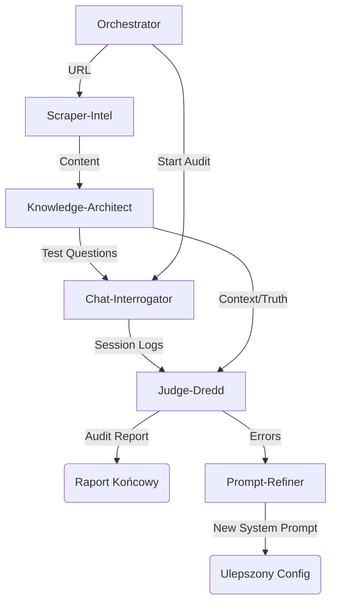

# Agents - Architektura Agentów TruthSeeker

System "TruthSeeker" opiera się na wyspecjalizowanych agentach pełniących ściśle określone role w procesie audytu i weryfikacji.

## 1. Orchestrator
**Cel**: Koordynacja całego procesu i zarządzanie przepływem pracy.
**Rola**: Kierownik Projektu.

### Odpowiedzialności:
- Przyjmowanie zleceń audytu.
- Delegowanie zadań do Scraper-Intel, Chat-Interrogator i innych.
- Agregacja wyników i generowanie raportu końcowego.
- Obsługa błędów i ponawianie prób.

---

## 2. Scraper-Intel
**Cel**: Inteligentne pozyskiwanie danych ze stron docelowych.
**Rola**: Analityk Wywiadu / Ekspert ds. Struktur Danych.

### Komponenty:
- **Navigation Module**: Symulacja ludzkiego zachowania na stronie (Playwright).
- **Content Extractor**: Wyciąganie merytorycznej treści (pomijanie reklam, menu).
- **Cleaner**: Oczyszczanie ze skryptów, stylów i szumu.

### Input/Output:
```
Input: URL strony docelowej
Output: Oczyszczony Markdown z metadanymi
```

---

## 3. Knowledge-Architect (RAG)
**Cel**: Budowa i zarządzanie strukturą wiedzy.
**Rola**: Bibliotekarz / Architekt Systemów Wiedzy.

### Komponenty:
- **Chunker**: Inteligentny podział tekstu na fragmenty semantyczne.
- **Embedder**: Generowanie wektorów (OpenAI/Local).
- **Question Generator**: Tworzenie pytań testowych na podstawie wiedzy.

### Input/Output:
```
Input: Surowy tekst (Markdown)
Output: Zaindeksowana baza wektorowa + Lista pytań testowych
```

---

## 4. Chat-Interrogator
**Cel**: Przeprowadzenie audytu (interakcji) z chatbotem.
**Rola**: Tajemniczy Klient / Audytor Terenowy.

### Komponenty:
- **Persona Engine**: Odgrywanie ról (np. "starsza osoba", "student").
- **Interaction Driver**: Wpisywanie pytań, obsługa czatu.
- **Session Recorder**: Rejestrowanie czasu reakcji i treści odpowiedzi.

---

## 5. Judge-Dredd
**Cel**: Bezwzględna ocena poprawności odpowiedzi.
**Rola**: Sędzia / Weryfikator Faktów.

### Komponenty:
- **Fact Verifier**: Porównanie odpowiedzi chatbota z Bzą Wiedzy (RAG).
- **Hallucination Detector**: Wykrywanie zmyślonych informacji.
- **Scoring Engine**: Ocena (Poprawna, Częściowa, Błąd, Halucynacja).

### Output:
```json
{
  "verdict": "HALUCYNACJA",
  "confidence": 0.95,
  "evidence": "Chatbot podał 8:00-16:00, baza wiedzy podaje 7:30-15:30"
}
```

---

## 6. Prompt-Refiner (NOWOŚĆ)
**Cel**: Pętla zwrotna - naprawa chatbota.
**Rola**: Inżynier Promptów / Lekarz Systemowy.

### Funkcjonalność:
Analizuje raporty błędów od Judge-Dreag i "leczy" system prompt testowanego bota.

### Metodologia:
1.  **Analiza Błędów**: Dlaczego bot skłamał? (Brak wiedzy? Zła instrukcja?).
2.  **Optymalizacja Promptu**: Dodanie reguł (constraints), few-shot examples.
3.  **Generowanie Nowego Promptu**: Gotowy tekst instrukcji ("Jesteś pomocnym asystentem...").

---

## Przepływ Komunikacji


