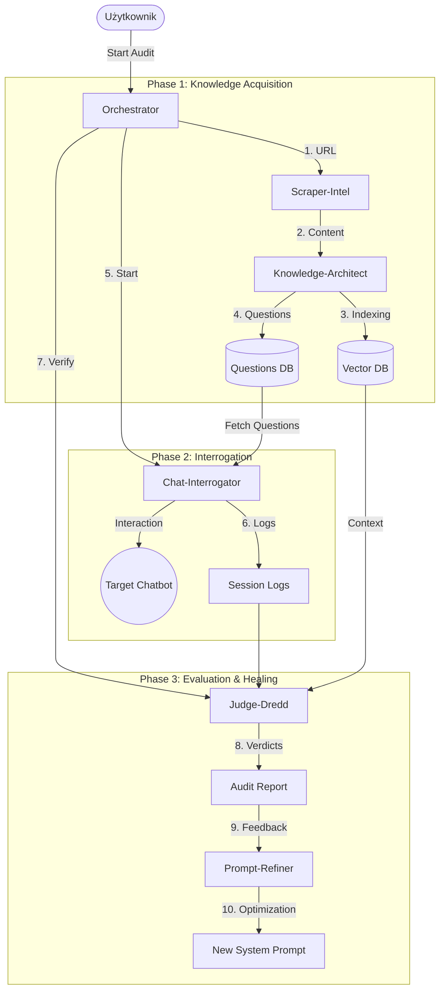

# Architektura Systemu TruthSeeker

## Diagram Wysokiego Poziomu



## Przepływ Danych (Data Flow)

### 1. Intelligence Gathering (Scraper-Intel + Knowledge-Architect)
```
URL → Scraper-Intel (Nav/Extract) → Markdown → Knowledge-Architect (Chunking) → Embeddings → Qdrant
                                              ↓
                                        Question Generator (LLM)
```

### 2. Live Interrogation (Chat-Interrogator)
```
Questions List → Chat-Interrogator (Playwright) → Target Chatbot UI
                                                      ↓
                                                Response Capture (Tekst + Czas)
```

### 3. Judgment Day (Judge-Dredd)
```
Q&A Pair + RAG Context → Judge-Dredd (LLM Eval) → Verdict (True/False/Hallucination)
```

### 4. System Evolution (Prompt-Refiner)
```
Audit Report (Errors) → Prompt-Refiner → Analysis → Recommended System Prompt v2
```

## Komponenty Szczegółowo

### Orchestrator Service
- **Technologia**: Python, Celery / Temporal (Workflow mgmt)
- **Rola**: Zarządzanie stanem procesu, retries, obsługa awarii.

### Scraper-Intel
- **Technologia**: Playwright, Beautiful Soup
- **Funkcje**:
    - Omijanie zabezpieczeń botowych.
    - Renderowanie dynamicznego JS.
    - Ekstrakcja semantyczna (nagłówki, listy).

### Knowledge-Architect
- **Baza**: Qdrant (Wektory), PostgreSQL (Metadane).
- **LLM**: OpenAI GPT-4 / local LLM.
- **Funkcje**:
    - Generowanie pytań "zaczepnych" (trudnych).
    - Budowanie "Golden Dataset" dla weryfikacji.

### Chat-Interrogator
- **Technologia**: Playwright / Puppeteer
- **Funkcje**:
    - Symulacja pisania (human-like typing).
    - Wykrywanie widgetów czatu.
    - Obsługa "streamowanych" odpowiedzi.

### Judge-Dredd
- **Technologia**: LLM (GPT-4 Turbo / Claude 3.5 Sonnet)
- **Funkcje**:
    - Fact-checking (RAG-based).
    - Analiza tonu i zgodności z personą.

### Prompt-Refiner (New Feature)
- **Technologia**: Advanced Prompt Engineering LLM Chain.
- **Wejście**: Raport Błędów + Oryginalny Prompt.
- **Wyjście**: Ulepszony Prompt Systemowy + Uzasadnienie.

## Bezpieczeństwo i Infrastruktura

- **Izolacja**: Każdy agent działa w kontenerze (Docker).
- **Rate Limiting**: Respektowanie limitów stron źródłowych.
- **Prywatność**: Redakcja danych osobowych (PII) w locie.
