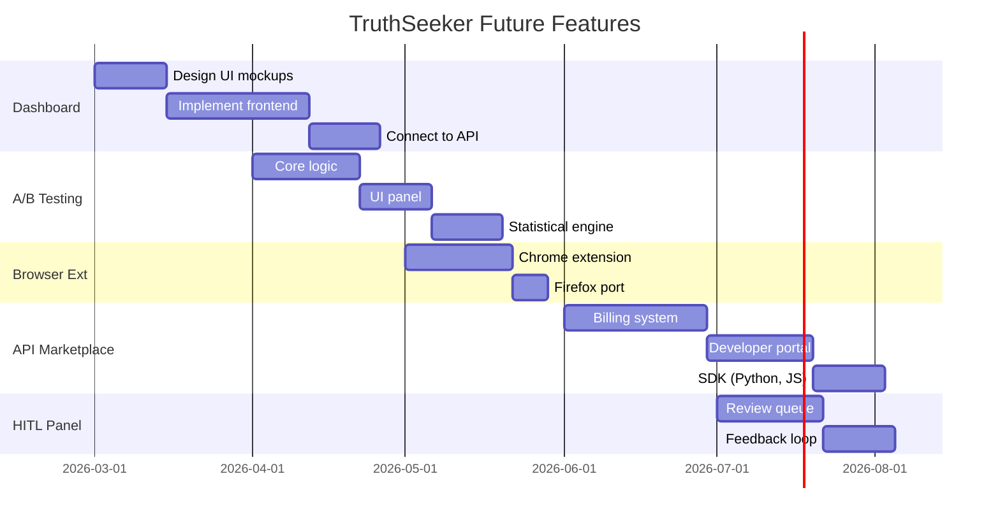

# Future Features Specifications - TruthSeeker

## 1. 📊 Dashboard z Wizualizacją Trendów

### Cel
Centralny panel do monitorowania jakości audytowanych chatbotów, trendów błędów i efektywności systemu.

### Ekrany

#### A) Overview (Strona Główna)
```
┌─────────────────────────────────────────────────────────────────────────┐
│  TRUTHSEEKER DASHBOARD                        🔔 Alerty: 3  👤 Admin   │
├─────────────────────────────────────────────────────────────────────────┤
│                                                                         │
│  ┌─────────────┐  ┌─────────────┐  ┌─────────────┐  ┌─────────────┐    │
│  │   87.3%     │  │    156      │  │    23       │  │   1.2s      │    │
│  │  Accuracy   │  │   Audytów   │  │  Alertów    │  │  Avg Time   │    │
│  │  ↑ 2.1%     │  │  ten tydzień│  │  otwartych  │  │  response   │    │
│  └─────────────┘  └─────────────┘  └─────────────┘  └─────────────┘    │
│                                                                         │
│  ┌──────────────────────────────────────────────────────────────────┐  │
│  │  ACCURACY TREND (30 dni)                                         │  │
│  │   100% ─┬────────────────────────────────────────────────────    │  │
│  │         │    ╭──╮                      ╭────╮                    │  │
│  │    80% ─┤───╯    ╰──────╮    ╭────────╯    ╰────╮               │  │
│  │         │                ╰──╯                    ╰──             │  │
│  │    60% ─┤                                                        │  │
│  │         └────────────────────────────────────────────────────    │  │
│  │           1 Jan    7 Jan    14 Jan    21 Jan    28 Jan           │  │
│  └──────────────────────────────────────────────────────────────────┘  │
│                                                                         │
│  ┌────────────────────────────┐  ┌────────────────────────────────┐    │
│  │  TOP PROBLEMATIC BOTS      │  │  ERROR CATEGORIES              │    │
│  ├────────────────────────────┤  ├────────────────────────────────┤    │
│  │  1. bot.urzad-x.pl  62%    │  │  ██████████ Halucynacje 45%   │    │
│  │  2. czat.miasto-y.pl 71%   │  │  ██████░░░░ Nieaktualne 28%   │    │
│  │  3. pomoc.gov.pl     78%   │  │  ████░░░░░░ Niekompletne 18%  │    │
│  └────────────────────────────┘  │  ██░░░░░░░░ Inne 9%           │    │
│                                  └────────────────────────────────┘    │
└─────────────────────────────────────────────────────────────────────────┘
```

#### B) Chatbot Details (Szczegóły Pojedynczego Bota)
```
┌─────────────────────────────────────────────────────────────────────────┐
│  CHATBOT: czat.urzad-krakow.pl                                         │
├─────────────────────────────────────────────────────────────────────────┤
│                                                                         │
│  Status: 🟡 Wymaga Uwagi    Ostatni Audyt: 2 godz. temu                │
│                                                                         │
│  ┌─────────────────────────────────────────────────────────────────┐   │
│  │  SCORE BREAKDOWN                                                 │   │
│  ├─────────────────────────────────────────────────────────────────┤   │
│  │  Faktyczna Poprawność:     ████████░░  78%                      │   │
│  │  Kompletność Odpowiedzi:   ██████░░░░  65%                      │   │
│  │  Czas Reakcji:             █████████░  92%                      │   │
│  │  Ton i Uprzejmość:         ██████████  98%                      │   │
│  └─────────────────────────────────────────────────────────────────┘   │
│                                                                         │
│  ┌─────────────────────────────────────────────────────────────────┐   │
│  │  RECENT ERRORS                                     [View All →] │   │
│  ├─────────────────────────────────────────────────────────────────┤   │
│  │  🔴 Q: "Godziny otwarcia?"                                      │   │
│  │     Bot: "8:00-16:00"  Prawda: "7:30-15:30"                     │   │
│  │     Kategoria: BŁĄD MERYTORYCZNY                                │   │
│  │                                                                  │   │
│  │  🟠 Q: "Czy potrzebuję dowodu do złożenia wniosku?"             │   │
│  │     Bot: "Tak, zawsze"  Prawda: "Zależy od typu wniosku"        │   │
│  │     Kategoria: CZĘŚCIOWO POPRAWNA                               │   │
│  └─────────────────────────────────────────────────────────────────┘   │
│                                                                         │
│  [ 🔄 Run New Audit ]  [ 📝 Edit Config ]  [ 📊 Export Report ]        │
└─────────────────────────────────────────────────────────────────────────┘
```

### Tech Stack
- **Frontend**: Next.js 14 + TailwindCSS + shadcn/ui
- **Charting**: Recharts lub Tremor
- **Real-time**: WebSocket dla live updates
- **State**: Zustand lub React Query

### API Endpoints
```
GET /api/dashboard/overview
GET /api/dashboard/chatbot/{id}/details
GET /api/dashboard/chatbot/{id}/history?days=30
GET /api/dashboard/alerts
POST /api/dashboard/chatbot/{id}/trigger-audit
```

---

## 2. 🧪 A/B Testing Promptów

### Cel
Automatyczne porównywanie wariantów promptów systemowych, aby znaleźć najskuteczniejszą wersję.

### Architektura

```
┌─────────────────────────────────────────────────────────────────┐
│                      A/B TEST MANAGER                           │
├─────────────────────────────────────────────────────────────────┤
│                                                                 │
│   Prompt A (Control)          Prompt B (Variant)               │
│   ┌─────────────────┐         ┌─────────────────┐              │
│   │ "Jesteś pomocnym│         │ "Jesteś eksper- │              │
│   │  asystentem..." │         │  tem miejskim..." │            │
│   └────────┬────────┘         └────────┬────────┘              │
│            │                           │                        │
│            ▼                           ▼                        │
│   ┌─────────────────┐         ┌─────────────────┐              │
│   │ 50 test cases   │         │ 50 test cases   │              │
│   │ (same dataset)  │         │ (same dataset)  │              │
│   └────────┬────────┘         └────────┬────────┘              │
│            │                           │                        │
│            ▼                           ▼                        │
│   ┌─────────────────┐         ┌─────────────────┐              │
│   │ Results A:      │         │ Results B:      │              │
│   │ Accuracy: 82%   │         │ Accuracy: 89%   │              │
│   │ Halluc.: 8%     │         │ Halluc.: 3%     │              │
│   │ Avg tokens: 450 │         │ Avg tokens: 380 │              │
│   └─────────────────┘         └─────────────────┘              │
│                                                                 │
│   ┌─────────────────────────────────────────────────────────┐  │
│   │  WINNER: Prompt B                                        │  │
│   │  Confidence: 95% (p-value: 0.023)                       │  │
│   │  Recommendation: Deploy Prompt B to production          │  │
│   └─────────────────────────────────────────────────────────┘  │
└─────────────────────────────────────────────────────────────────┘
```

### Workflow

```python
class PromptABTest:
    def __init__(self, test_name: str):
        self.test_name = test_name
        self.variants = {}
        self.results = {}
    
    def add_variant(self, name: str, prompt: str, traffic_percent: int = 50):
        self.variants[name] = {
            "prompt": prompt,
            "traffic": traffic_percent
        }
    
    def run(self, test_cases: list[TestCase], evaluator: JudgeDredd) -> ABTestResult:
        for variant_name, config in self.variants.items():
            results = []
            for case in test_cases:
                response = self._generate_response(config["prompt"], case.question)
                verdict = evaluator.evaluate(case.question, response, case.context)
                results.append(verdict)
            
            self.results[variant_name] = self._aggregate(results)
        
        return self._determine_winner()
    
    def _determine_winner(self) -> ABTestResult:
        # Statistical significance test (chi-squared lub t-test)
        winner = max(self.results, key=lambda k: self.results[k]["accuracy"])
        p_value = self._calculate_p_value()
        
        return ABTestResult(
            winner=winner,
            is_significant=p_value < 0.05,
            p_value=p_value,
            metrics=self.results
        )
```

### UI - Test Configuration

```
┌─────────────────────────────────────────────────────────────────┐
│  CREATE A/B TEST                                                │
├─────────────────────────────────────────────────────────────────┤
│                                                                 │
│  Test Name: [prompt_guardrails_v2_test________________]        │
│                                                                 │
│  ┌───────────────────────────────────────────────────────────┐ │
│  │ VARIANT A (Control - 50%)                                 │ │
│  │ ┌─────────────────────────────────────────────────────┐   │ │
│  │ │ Jesteś pomocnym asystentem miejskim...              │   │ │
│  │ │ Odpowiadaj krótko i rzeczowo.                       │   │ │
│  │ └─────────────────────────────────────────────────────┘   │ │
│  └───────────────────────────────────────────────────────────┘ │
│                                                                 │
│  ┌───────────────────────────────────────────────────────────┐ │
│  │ VARIANT B (Treatment - 50%)                               │ │
│  │ ┌─────────────────────────────────────────────────────┐   │ │
│  │ │ Jesteś pomocnym asystentem miejskim...              │   │ │
│  │ │ WAŻNE: Jeśli nie masz pewnych informacji w         │   │ │
│  │ │ kontekście, powiedz "nie posiadam tej informacji". │   │ │
│  │ └─────────────────────────────────────────────────────┘   │ │
│  └───────────────────────────────────────────────────────────┘ │
│                                                                 │
│  Test Dataset: [Golden Dataset v3 (150 cases)________] ▼       │
│  Evaluator: [Judge-Dredd Standard_______________] ▼            │
│                                                                 │
│  [ Cancel ]                            [ 🚀 Start Test ]       │
└─────────────────────────────────────────────────────────────────┘
```

### Metryki A/B Test

| Metryka | Opis |
|---------|------|
| `accuracy` | % poprawnych odpowiedzi |
| `hallucination_rate` | % halucynacji |
| `avg_response_tokens` | Średnia długość (tokeny) |
| `avg_latency_ms` | Średni czas odpowiedzi |
| `user_satisfaction` | (opcjonalnie) ocena użytkowników |

---

## 3. 🌐 Browser Extension

### Cel
Szybka weryfikacja dowolnego tekstu na stronie internetowej bez opuszczania przeglądarki.

### User Flow

```
1. Użytkownik zaznacza tekst na stronie
2. Klikaj prawym → "Verify with TruthSeeker" LUB skrót Ctrl+Shift+V
3. Popup pokazuje wynik weryfikacji
4. Użytkownik widzi ✅/⚠️/❌ i źródła
```

### UI - Popup

```
┌─────────────────────────────────────────┐
│  🔍 TRUTHSEEKER VERIFY                  │
├─────────────────────────────────────────┤
│                                         │
│  "Urząd jest czynny od 8 do 16"        │
│                                         │
│  ┌─────────────────────────────────┐   │
│  │  ⚠️ CZĘŚCIOWO POPRAWNA          │   │
│  │  Confidence: 87%                │   │
│  └─────────────────────────────────┘   │
│                                         │
│  📋 Szczegóły:                         │
│  Urząd czynny: 7:30-15:30              │
│  (piątki do 14:00)                     │
│                                         │
│  📎 Źródło:                            │
│  urzad-krakow.pl/kontakt               │
│  Ostatnia aktualizacja: 2 dni temu     │
│                                         │
│  [ 🔗 Szczegóły ] [ 📝 Zgłoś Błąd ]    │
└─────────────────────────────────────────┘
```

### Architektura Extension

```
┌─────────────────────────────────────────────────────────────┐
│                    BROWSER EXTENSION                        │
├─────────────────────────────────────────────────────────────┤
│                                                             │
│  ┌───────────────┐                                         │
│  │ Content Script│ → Nasłuchuje zaznaczenia tekstu         │
│  └───────┬───────┘                                         │
│          │                                                  │
│          ▼                                                  │
│  ┌───────────────┐                                         │
│  │ Background SW │ → Wysyła request do API                 │
│  └───────┬───────┘                                         │
│          │                                                  │
│          ▼                                                  │
│  ┌───────────────┐                                         │
│  │ Popup UI      │ → Wyświetla wynik                       │
│  └───────────────┘                                         │
│                                                             │
└─────────────────────────────────────────────────────────────┘
              │
              ▼
┌─────────────────────────────────────────────────────────────┐
│                 TRUTHSEEKER API                             │
│                                                             │
│  POST /api/v1/verify/quick                                  │
│  {                                                          │
│    "claim": "Urząd jest czynny od 8 do 16",                │
│    "page_url": "https://example.com/page",                 │
│    "page_context": "...surrounding text..."                 │
│  }                                                          │
└─────────────────────────────────────────────────────────────┘
```

### Tech Stack
- **Framework**: Plasmo (Chrome/Firefox/Edge)
- **UI**: React + TailwindCSS
- **Storage**: chrome.storage.local (cache wyników)
- **Auth**: API Key w ustawieniach

### Funkcje

| Funkcja | Opis |
|---------|------|
| **Quick Verify** | Zaznacz → Weryfikuj (główna funkcja) |
| **Page Scan** | Skanuj całą stronę pod kątem potencjalnych błędów |
| **History** | Historia weryfikacji z danej sesji |
| **Settings** | API Key, domyślne źródła, hotkeys |

---

## 4. 🏪 API Marketplace (Fact-Checking as a Service)

### Cel
Monetyzacja API - inne firmy mogą korzystać z naszego fact-checkingu.

### Pricing Tiers

```
┌─────────────────────────────────────────────────────────────────┐
│                    TRUTHSEEKER API PLANS                        │
├─────────────────────────────────────────────────────────────────┤
│                                                                 │
│  ┌─────────────┐  ┌─────────────┐  ┌─────────────┐             │
│  │   FREE      │  │   PRO       │  │ ENTERPRISE  │             │
│  │   $0/mo     │  │   $99/mo    │  │  Custom     │             │
│  ├─────────────┤  ├─────────────┤  ├─────────────┤             │
│  │ 100 req/day │  │ 10k req/day │  │ Unlimited   │             │
│  │ Basic RAG   │  │ Full RAG    │  │ Custom RAG  │             │
│  │ 3s timeout  │  │ 10s timeout │  │ Priority    │             │
│  │ No SLA      │  │ 99% SLA     │  │ 99.9% SLA   │             │
│  │ Community   │  │ Email supp. │  │ Dedicated   │             │
│  └─────────────┘  └─────────────┘  └─────────────┘             │
│                                                                 │
│  [ Get Started Free ]  [ Start Pro Trial ]  [ Contact Sales ]  │
└─────────────────────────────────────────────────────────────────┘
```

### API Endpoints

```yaml
# Główne endpointy

POST /api/v1/verify:
  description: Zweryfikuj pojedyncze stwierdzenie
  request:
    claim: string           # Tekst do weryfikacji
    domain: string?         # Opcjonalna domena źródłowa
    language: string?       # pl, en, de...
  response:
    verdict: PRAWDA | FAŁSZ | CZĘŚCIOWA | NIEZNANE
    confidence: float       # 0.0 - 1.0
    evidence: Evidence[]    # Lista dowodów
    sources: Source[]       # Źródła

POST /api/v1/verify/batch:
  description: Weryfikuj wiele stwierdzeń naraz
  request:
    claims: string[]
  response:
    results: VerifyResult[]

GET /api/v1/sources:
  description: Lista dostępnych źródeł wiedzy
  response:
    sources: Source[]
    last_updated: datetime

POST /api/v1/sources/custom:
  description: Dodaj własne źródło (Enterprise)
  request:
    url: string
    name: string
    refresh_interval: string
```

### Dashboard dla Klientów API

```
┌─────────────────────────────────────────────────────────────────┐
│  MY API DASHBOARD                           Plan: PRO ($99/mo)  │
├─────────────────────────────────────────────────────────────────┤
│                                                                 │
│  API Key: ts_live_sk_•••••••••••••••••••abc123    [Regenerate] │
│                                                                 │
│  ┌─────────────────────────────────────────────────────────┐   │
│  │  USAGE THIS MONTH                                        │   │
│  │                                                          │   │
│  │  Requests:  ████████████░░░░░░░░  6,234 / 10,000        │   │
│  │  Remaining: 3,766                                        │   │
│  │  Resets in: 12 days                                      │   │
│  └─────────────────────────────────────────────────────────┘   │
│                                                                 │
│  ┌─────────────────────────────────────────────────────────┐   │
│  │  USAGE OVER TIME                                         │   │
│  │    1k ─┬─────────╮                                       │   │
│  │        │          ╰──────╮    ╭──────                    │   │
│  │   500 ─┤                  ╰──╯                           │   │
│  │        └──────────────────────────────────────           │   │
│  │          Mon   Tue   Wed   Thu   Fri   Sat   Sun         │   │
│  └─────────────────────────────────────────────────────────┘   │
│                                                                 │
│  [ View Logs ]  [ Download Invoice ]  [ Upgrade Plan ]         │
└─────────────────────────────────────────────────────────────────┘
```

### SDK (Python Example)

```python
from truthseeker import TruthSeekerClient

client = TruthSeekerClient(api_key="ts_live_sk_...")

# Pojedyncza weryfikacja
result = client.verify("Urząd jest czynny od 8 do 16")
print(result.verdict)      # "CZĘŚCIOWA"
print(result.confidence)   # 0.87
print(result.evidence[0])  # "Urząd czynny 7:30-15:30"

# Batch weryfikacja
results = client.verify_batch([
    "Parking przy urzędzie jest płatny",
    "Wniosek o dowód składa się online",
    "Urząd nie pracuje w soboty"
])
```

---

## 5. 👤 Human-in-the-Loop Panel

### Cel
Panel dla ludzkich operatorów do review'owania edge case'ów, gdzie AI nie jest pewne decyzji.

### Kiedy Escalacja?

```python
class EscalationPolicy:
    thresholds = {
        "low_confidence": 0.6,        # Confidence < 60%
        "conflicting_evidence": True,  # Źródła się sprzeczają
        "sensitive_topic": ["finanse", "prawo", "zdrowie"],
        "first_occurrence": True,      # Nigdy nie widzieliśmy tego pytania
    }
    
    def should_escalate(self, verdict: Verdict) -> bool:
        if verdict.confidence < self.thresholds["low_confidence"]:
            return True
        if verdict.has_conflicting_evidence:
            return True
        if verdict.topic in self.thresholds["sensitive_topic"]:
            return True
        return False
```

### UI - Review Queue

```
┌─────────────────────────────────────────────────────────────────────────┐
│  HUMAN REVIEW QUEUE                                    🔴 23 pending    │
├─────────────────────────────────────────────────────────────────────────┤
│                                                                         │
│  Filter: [All ▼]  Priority: [High First ▼]  Assignee: [Me ▼]           │
│                                                                         │
│  ┌───────────────────────────────────────────────────────────────────┐ │
│  │ #127 | 🔴 HIGH | Conflicting Evidence           | 2 min ago       │ │
│  ├───────────────────────────────────────────────────────────────────┤ │
│  │                                                                    │ │
│  │  QUESTION:                                                         │ │
│  │  "Czy mogę złożyć wniosek o zasiłek online?"                      │ │
│  │                                                                    │ │
│  │  CHATBOT ANSWER:                                                   │ │
│  │  "Tak, wszystkie wnioski można składać przez ePUAP."              │ │
│  │                                                                    │ │
│  │  AI VERDICT: ⚠️ UNCERTAIN (confidence: 0.52)                       │ │
│  │                                                                    │ │
│  │  EVIDENCE:                                                         │ │
│  │  ┌──────────────────────────────────────────────────────────────┐ │ │
│  │  │ 📄 Source A (urzad.pl/zasilki):                              │ │ │
│  │  │ "Wnioski o zasiłki składa się osobiście lub listownie"       │ │ │
│  │  │ Updated: 2025-06-15                                          │ │ │
│  │  ├──────────────────────────────────────────────────────────────┤ │ │
│  │  │ 📄 Source B (gov.pl/epuap):                                  │ │ │
│  │  │ "Od 2026 roku wszystkie wnioski przez ePUAP"                 │ │ │
│  │  │ Updated: 2026-01-10                                          │ │ │
│  │  └──────────────────────────────────────────────────────────────┘ │ │
│  │                                                                    │ │
│  │  YOUR DECISION:                                                    │ │
│  │  ○ ✅ POPRAWNA    ○ ⚠️ CZĘŚCIOWA    ○ ❌ BŁĘDNA                    │ │
│  │                                                                    │ │
│  │  Komentarz: [_________________________________________]           │ │
│  │                                                                    │ │
│  │  [ Skip ]  [ Assign to Expert ]  [ ✓ Submit Decision ]            │ │
│  └───────────────────────────────────────────────────────────────────┘ │
│                                                                         │
│  ┌───────────────────────────────────────────────────────────────────┐ │
│  │ #126 | 🟡 MEDIUM | Low Confidence              | 15 min ago       │ │
│  │ "Czy urząd przyjmuje płatności kartą?"                            │ │
│  │ AI: PRAWDA (0.58)                                      [Review →] │ │
│  └───────────────────────────────────────────────────────────────────┘ │
│                                                                         │
└─────────────────────────────────────────────────────────────────────────┘
```

### Feedback Loop

```
┌─────────────────────────────────────────────────────────────┐
│                    LEARNING CYCLE                           │
├─────────────────────────────────────────────────────────────┤
│                                                             │
│   ┌───────────┐                                            │
│   │ AI Verdict│ ──→ Low Confidence ──→ Escalate           │
│   └───────────┘                           │                │
│                                           ▼                │
│                                    ┌─────────────┐         │
│                                    │Human Review │         │
│                                    └──────┬──────┘         │
│                                           │                │
│                    ┌──────────────────────┼───────┐        │
│                    ▼                      ▼       ▼        │
│            ┌────────────┐         ┌────────────────────┐   │
│            │ Update RAG │         │ Add to Training Set│   │
│            │ (new source)│         │ (fine-tune prompt) │   │
│            └────────────┘         └────────────────────┘   │
│                                                             │
└─────────────────────────────────────────────────────────────┘
```

### Metryki Operatorów

| Metryka | Opis |
|---------|------|
| `reviews_completed` | Liczba review'ów |
| `avg_review_time` | Średni czas na review |
| `override_rate` | % decyzji AI zmienionych przez człowieka |
| `escalation_rate` | % przypadków wymagających ekspertaów |

---

## 6. 📅 Implementation Roadmap



---

## 7. 📋 Priority Matrix

| Feature | Impact | Effort | Priority |
|---------|--------|--------|----------|
| Dashboard | 🔼 High | 🔸 Medium | **P1** |
| HITL Panel | 🔼 High | 🔸 Medium | **P1** |
| A/B Testing | 🔼 High | 🔻 Low | **P2** |
| Browser Extension | 🔸 Medium | 🔻 Low | **P2** |
| API Marketplace | 🔼 High | 🔺 High | **P3** |
